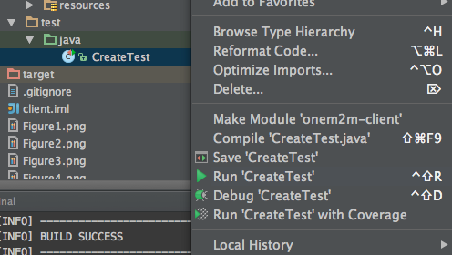

# Iotdm-client

[Iotdm (Internet of Thing Data Management)](https://wiki.opendaylight.org/view/IoTDM:Main) is data-centric server or middleware that will act as a oneM2M compliant IoT Data Broker (IOTDM) and enable authorized applications to retrieve IoT data uploaded by any device.  

 OneM2M message can be carried by different protocols. The binding documents(TS-0004,TS-0008,TS-0009,TS-0010) show the specific binding between protocls message and OneM2M message. A summary can be found [here](https://wiki.opendaylight.org/images/9/93/API_Calls_Examples.pdf).

This project aims to provide a oneM2M-compliant client that encapsulate all the complexity of protocol-to-oneM2M binding. The API for developer is based on data model (Java classes) generated from OneM2M XSD.

###Pre-Requirement
Maven version: 3.2+  
Java versison: 1.7+     
Onem2m xsd version:1.2.0

###Set up 
Download the project, and at the root of project:
```bash
mvn clean install
```

Example
====
the example is in **"src/main/test/java"**

###Restconf API
***Restconf interface*** aims to provide admin http access to Iotdm. So in this project, only Http implements Restconf API.
```java
public interface RestconfApi {
    ...
    public void restConf(String url,String payload,String username,String password);
}
```

###Client API
***Client interface*** is for implementation of OneM2M Client in different protocols(Http, Coap, Mqtt). 
```java
public interface ClientApi {
    public void start();
    public void stop();
    public void send(Exchange iotdmExchange);
}
```

Currently, an implementation of HTTP is provided. In future, Coap and Mqtt is comming soon.


***Exchange*** is content carrier for bidirectional communication, in which both RequestPrimitive and ResponsePrimitive are data model class,carrying request content and response content respectively.  

```java
public class Exchange {
    private RequestPrimitive requestPrimitive;
    private ResponsePrimitive responsePrimitive;
    private String host;
    private String port;
    private String timeout;
    private Client client;
    ...
}
```

###Data Model
***Data model*** is generated based on OneM2M XSD file, which is mainly for content carry and exchange. 

All data model Java classes are list below:

| | |
--- | --- 
AE.java|                    FilterCriteria.java|
AEAnnc.java|                Firmware.java|
AccessControlPolicy.java|       FirmwareAnnc.java|
AccessControlPolicyAnnc.java|       Group.java|
AccessControlRule.java|         GroupAnnc.java|
ActionStatus.java|          LocationPolicy.java|
ActiveCmdhPolicy.java|          LocationPolicyAnnc.java|
AggregatedNotification.java|        LocationRegion.java|
AggregatedRequest.java|         M2MServiceSubscriptionProfile.java|
AggregatedResponse.java|            Memory.java|
AnnounceableResource.java|      MemoryAnnc.java|
AnnounceableSubordinateResource.java|   MetaInformation.java|
AnnouncedMgmtResource.java|     MgmtCmd.java|
AnnouncedResource.java|         MgmtLinkRef.java|
AnnouncedSubordinateResource.java|  MgmtResource.java|
AnyArgType.java|                Node.java|
AreaNwkDeviceInfo.java|         NodeAnnc.java|
AreaNwkDeviceInfoAnnc.java|     Notification.java|
AreaNwkInfo.java|           ObjectFactory.java|
AreaNwkInfoAnnc.java|           OperationResult.java|
Attribute.java|             PollingChannel.java|
AttributeList.java|         PrimitiveContent.java|
BatchNotify.java|           RateLimit.java|
Battery.java|               Reboot.java|
BatteryAnnc.java|           RebootAnnc.java|
CSEBase.java|               RebootArgsType.java|
ChildResourceRef.java|          RegularResource.java|
CmdhBuffer.java|                RemoteCSE.java|
CmdhDefEcValue.java|            RemoteCSEAnnc.java|
CmdhDefaults.java|          Request.java|
CmdhEcDefParamValues.java|      RequestPrimitive.java|
CmdhLimits.java|                ResetArgsType.java|
CmdhNetworkAccessRules.java|        Resource.java|
CmdhNwAccessRule.java|          ResourceWrapper.java|
CmdhPolicy.java|                ResponsePrimitive.java|
Container.java|             ResponseTypeInfo.java|
ContainerAnnc.java|         Schedule.java|
ContentInstance.java|           ScheduleAnnc.java|
ContentInstanceAnnc.java|       ScheduleEntries.java|
Delivery.java|              ServiceSubscribedAppRule.java|
DeliveryMetaData.java|          ServiceSubscribedNode.java|
DeviceCapability.java|          SetOfAcrs.java|
DeviceCapabilityAnnc.java|      Software.java|
DeviceInfo.java|                SoftwareAnnc.java|
DeviceInfoAnnc.java|            SoftwareInstallArgsType.java|
DownloadArgsType.java|          SoftwareUninstallArgsType.java|
EventConfig.java|           SoftwareUpdateArgsType.java|
EventLog.java|              StatsCollect.java|
EventLogAnnc.java|          StatsConfig.java|
EventNotificationCriteria.java|     Subscription.java|
ExecInstance.java|          UploadArgsType.java|
ExecReqArgsListType.java|       package-info.java|


##Step-by-Step Example
####Provision Tree
Provisioning the tree means create the root of resource tree in the Iotdm server.This operation needs admin access permission. So it is only accessed through Restconf.  
```java
public void provisionTree(){
    Http http=new Http();
    http.start();
    http.restConf(
         RestconfApi.URL,
         RestconfApi.PAYLOAD,
         RestconfApi.USERNAME,
         RestconfApi.PASSWORD
    );
    http.stop();
}
```
This example use default setting for provisioning that create root resource named as InCSE1. The type of root is CSEBase.  

   
####Create AE under root
```java
public void createAE(){
        //AE Resource to be created
        AE ae=new AE();
        ae.setAEID("1234");
        ae.setAppName("1234");
        ae.setOntologyRef("iphone");
        //Request carrying AE to be created.
        RequestPrimitive requestPrimitive=new RequestPrimitive();
        requestPrimitive.setFrom("local");
        //Set Destination from root of Resource for creation
        requestPrimitive.setTo("InCSE1");
        //Resource Name of resource to be created
        requestPrimitive.setName("AE");
        //Set OneM2m Operation
        requestPrimitive.setOperation(OneM2M.Operation.CREATE.value());
        requestPrimitive.setRequestIdentifier("12345");
        //Set ResourceType to be created
        requestPrimitive.setResourceType(OneM2M.ResourceType.AE.value());
        requestPrimitive.setPrimitiveContent(new PrimitiveContent());
        //Request carry resource content
        requestPrimitive.getPrimitiveContent().getAny().add(ae);

        //Exchange carry the content of request and destination of request
        Exchange exchange=new Exchange();
        exchange.setHost("localhost");
        exchange.setPort("8282");
        exchange.setRequestPrimitive(requestPrimitive);

        //Initialization of Http client responsible for transmission.
        Http http=new Http();
        http.start();
        http.send(exchange);
        http.stop();
    }
```


####Update AE
```java
public void update(){
        //AE Resource to be updated
        AE ae=new AE();

        //Updated Attribute
        ae.setOntologyRef("ipad");

        //Request carrying AE to be updated.
        RequestPrimitive requestPrimitive=new RequestPrimitive();
        requestPrimitive.setFrom("local");
        //Set path of resource to be updated
        requestPrimitive.setTo("InCSE1/AE1");
        //Set OneM2m Operation
        requestPrimitive.setOperation(OneM2M.Operation.UPDATE.value());
        requestPrimitive.setRequestIdentifier("12345");
        requestPrimitive.setPrimitiveContent(new PrimitiveContent());
        //Request carry resource content
        requestPrimitive.getPrimitiveContent().getAny().add(ae);

        //Exchange carry the updated content of request and destination of request
        Exchange exchange=new Exchange();
        exchange.setHost("localhost");
        exchange.setPort("8282");
        exchange.setRequestPrimitive(requestPrimitive);

        //Initialization of Http client responsible for transmission.
        Http http=new Http();
        http.start();
        http.send(exchange);
        http.stop();
        System.out.println(exchange.toString());
    }
```


####Retrieve AE 
```java
    public void retrieve(){
        //Request
        RequestPrimitive requestPrimitive=new RequestPrimitive();
        requestPrimitive.setRequestIdentifier("12345");
        requestPrimitive.setFrom("local");
        //Set the path of resource to be retrieved
        requestPrimitive.setTo("InCSE1/AE1");
        //Set OneM2m Operation
        requestPrimitive.setOperation(OneM2M.Operation.RETRIEVE.value());
        
        //Exchange carry the content of request and destination of request
        Exchange exchange=new Exchange();
        exchange.setHost("localhost");
        exchange.setPort("8282");
        exchange.setRequestPrimitive(requestPrimitive);

        //Initialization of Http client responsible for transmission.
        Http http=new Http();
        http.start();
        http.send(exchange);
        http.stop();
    }
```

####Delete AE
```java
  public void delete(){
        //Request
        RequestPrimitive requestPrimitive=new RequestPrimitive();
        requestPrimitive.setFrom("local");
        requestPrimitive.setRequestIdentifier("12345");

        //Set the path of resource to be deleted
        requestPrimitive.setTo("InCSE1/AE1");
        requestPrimitive.setOperation(OneM2M.Operation.DELETE.value());

        //Exchange carry the content of request and destination of request
        Exchange exchange=new Exchange();
        exchange.setHost("localhost");
        exchange.setPort("8282");
        exchange.setRequestPrimitive(requestPrimitive);

        //Initialization of Http client responsible for transmission.
        Http http=new Http();
        http.start();
        http.send(exchange);
        http.stop();
        System.out.println(exchange.toString());
    }
```


Notice
====

1. the Test order is random, so sometomes you will **see failure such as cannot find the resource**,  
but if you run the test one by one, you will see the correct results.

2. 2 way to trigger the test.

* if you install maven, just need to go the root directory and type   `mvn clean install`
* if you don't have maven, go the test folder, find "CreateTest", run it.
